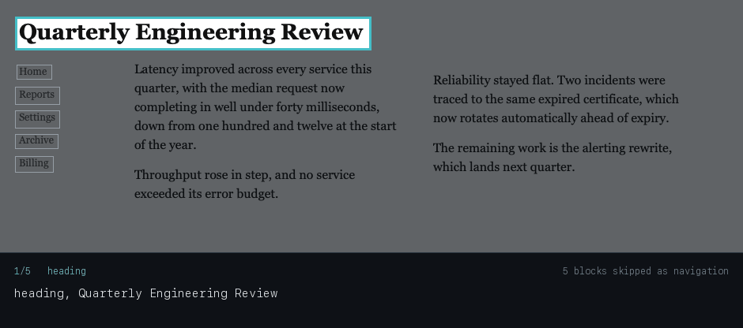

# Slicer

**A screen reader that reads any window aloud — in the order a person would read it.**

Slicer works from pixels, not the accessibility tree. That means it reads the
things other screen readers cannot: PDFs in a third-party viewer, remote
desktop sessions, canvas and Electron apps that expose nothing, video frames,
legacy internal tools, a screenshot someone pasted into chat.

Everything runs on your Mac. Nothing is uploaded, no account, no network calls
at all — the recognition and the speech are both Apple frameworks already on
the machine.



<sub>Slicer reading an SEC filing in Preview — a PDF, where the accessibility
tree gives a screen reader almost nothing. The box marks the block being
spoken. Recorded on macOS 15.3; the full clip is attached to the
[latest release](https://github.com/Kush-Meta/slicer/releases). Silent, because
capturing system audio needs a virtual audio device.</sub>

### Why the order is the hard part


<sub>Generated from real pipeline output, not drawn: the same capture,
recognition, layout and editor stages a live reading uses. Each frame
highlights the block Slicer actually chose next, captioned with the words it
would speak, with skipped navigation outlined. Regenerate with
`./.venv/bin/python scripts/make_demo.py`.</sub>

```bash
./bin/slicer menubar          # run it in the menu bar, then press ⌘⌃R anywhere
./bin/slicer navigate --window   # read the frontmost window and move around it
./bin/slicer doctor           # check this machine and measure the latency budget
```

---

## Why it exists

Every screen reader walks the accessibility tree. When that tree is well-formed
nothing beats it — it is free, instant and exactly right. The problem is how
often it isn't there.

Slicer takes the other route: treat the screen as a document. Capture pixels,
recover layout, infer reading order, speak. That buys universality, and costs
two things this project is mostly about.

**Reading order is the hard problem, not OCR.** Text recognition is a
commodity. What no recognizer gives you is the answer to *what comes next* on a
screen with a sidebar, a sticky header, a two-column article and a floating
chat bubble. Sorting recognized text top-to-bottom reads a two-column page
straight across, which is what every simple read-aloud tool does:

> A second column of body **Reading order is the hard** text that should be
> read **problem here, not the text**…

Slicer uses a recursive XY-cut: find a vertical gutter no line crosses and the
region is columns, so read left fully then right; otherwise find a horizontal
gap and read top then bottom. It is deterministic and cannot hallucinate,
because it only ever permutes the lines it was given.

**Latency is the other.** A reader that takes a second to start talking feels
dead. Slicer speaks the first word in about 150 ms by recognizing the top of
the capture first and reading the rest on another thread.

## The rule everything else defers to

> **No model may author words that get spoken.**

Every word of content traces back to a token recognition actually found on
screen, checked on every block of every reading — in the live path, not in
tests. Anything Slicer says on its own account (a heading announcement, "row 2
of 4", "unclear") lives in a separate field, so a listener can always tell the
tool's voice from the screen's.

This is load-bearing before any model exists, which is the point. It has
already caught real bugs: dehyphenation producing a word in no source token, a
generated line count concatenated into content, and unicode normalization
silently dropping whole paragraphs.

## Using it

### In the menu bar

```bash
./bin/slicer menubar
```

Look for **◉**. Press **⌘⌃R** from any application, drag a region, and it
reads — with a highlight following the block being spoken. The hotkey uses
Carbon's `RegisterEventHotKey`, which needs no Accessibility permission and
only ever sees that one combination.

### Reading and navigating

```bash
./bin/slicer read --window            # read the frontmost window
./bin/slicer read --follow            # keep reading as the content scrolls
./bin/slicer navigate --window        # read it, then move through it
./bin/slicer plan --window            # show what would be read, silently
```

During `navigate`, matching the conventions NVDA, JAWS and VoiceOver share:

| key | |
|---|---|
| `n` / `p`, arrows | next / previous block |
| `h` / `H` | next / previous heading |
| `t` / `T` | next / previous table row |
| `c` / `C`, `l` / `L` | next / previous code block, list item |
| `,` / `.` | first / last |
| `a` | read everything from here |
| `r` / `s` / `w` | repeat / spell out / where am I |
| `esc` / `q` | stop speaking / quit |

Every move interrupts speech immediately, and every move that finds nothing
says so — silence after a keypress is indistinguishable from a crash.

### Preferences

```bash
./bin/slicer settings                       # show what is saved
./bin/slicer settings --voice Alice --rate 200 --verbosity high
./bin/slicer voices                         # what this Mac can speak with
```

Verbosity controls how much structure is announced. A sighted reader gets
structure free from layout; spoken, it is gone unless someone says it.

### The resident process

```bash
./bin/slicer daemon --background   # or just use the menu bar
./bin/slicer status
./bin/slicer stop
```

Recognition costs about 460 ms in a cold process and 155 ms in a warm one, so
a resident process makes every reading after the first much faster.

## Measured on an M-series Mac, macOS 15.3

| Stage | Cold | Warm |
|---|---|---|
| Capture, full screen | 90 ms | **14 ms** |
| Recognition, whole window | 459 ms | 459 ms |
| Recognition, top quarter | — | **155 ms** |
| Layout and ordering | <1 ms | <1 ms |
| Speech, to first audio | — | **5–14 ms** |
| **First spoken word** | 709 ms | **154 ms** |

Capture is in-process CoreGraphics rather than the `screencapture` binary, and
pixels go straight to Vision without ever becoming a file. Speaking starts from
the top quarter of the capture while the rest is recognized in parallel.

Two optimisations were measured and rejected. Vision's *fast* recognition level
is eight times quicker and unusable — character agreement as low as 20%,
reading order wrong on three of seven test pages, `prose` recognized as
`PTose`. And `minimumTextHeight`, which Apple documents as downsizing the input
to save time, made no difference here. Speed is bought with area, not accuracy.

## How it is put together

```
bin/slicer              launcher (uses the project venv)
slicer/
  blocks.py             the grounded data model — TextLine, Block, Slice
  capture.py            capture, and the checks that stop silent failure
  windows.py            naming a target instead of drawing one
  picker.py             the drag overlay, and the coordinates it returns
  ocr.py                Apple Vision, boxes flipped to a top-left origin
  layout.py             XY-cut ordering, grouping, classification
  editor.py             speakable text, and assert_grounded
  speech.py             in-process synthesis, with say(1) as a fallback
  narrator.py           scheduling, transport, epoch cancellation
  navigator.py          structural movement: headings, tables, spelling
  interactive.py        the key loop, kept responsive while speech runs
  conductor.py          the state machine and the degradation ladder
  fingerprint.py        line fingerprints for reading past the fold
  continuity.py         scrolling, and where to resume afterwards
  daemon.py / ipc.py    the resident process; AppKit on main, sockets off it
  hotkey.py             one global hotkey, via Carbon rather than an event tap
  overlay.py            the highlight that follows the reading
  menubar.py            the status item, and the run loop it brings with it
  settings.py           preferences that survive a restart
scripts/                doctor-adjacent tools: content-protection check,
                        pipeline profiler, and the README animation
tests/                  146 tests across 15 suites, no external runner needed
```

Run everything with `./.venv/bin/python tests/run_all.py`.

The test corpus is deliberately two things: synthetic pages drawn at known
coordinates, where ground truth is exact, and **golden pages rendered by
WebKit**, so reading order is tested against real CSS layout rather than my own
assumptions. Two bugs were only ever visible on the second kind.

`ENGINEERING_LOG.md` records how this was built and every bug found while
testing it, with root causes — including several that produced silent data
loss and one measurement that turned out to be wrong.

## Setup

```bash
git clone https://github.com/Kush-Meta/slicer.git
cd slicer
python3 -m venv .venv
./.venv/bin/pip install -r requirements.txt
./.venv/bin/python tests/run_all.py
./bin/slicer doctor
```

Grant **Screen Recording** to the terminal running Slicer, in System Settings →
Privacy & Security. macOS does not apply the grant to a running process, so
fully quit and reopen the terminal afterwards.

Requires macOS 14+ and Apple Silicon or Intel with the Vision framework. There
is no model to download.

## Privacy

Slicer captures the screen, so it is worth being exact about what that means.

- **Nothing leaves the machine.** There are no network calls in the codebase.
  Recognition and speech are Apple frameworks running locally.
- **Nothing is stored** unless you ask. Live captures keep pixels in memory and
  never write a file.
- **Telemetry is local**, in `~/.slicer/`, and is stage timings only.
- On macOS 15.3.1, windows marked `NSWindowSharingNone` — the flag password
  managers use — are correctly excluded from capture. `scripts/verify_content_protection.py`
  re-checks this, and should be re-run on every major OS release.

## Known limits

- macOS only. The capture layer is platform-specific; everything above it is not.
- No deep parse yet. XY-cut handles documents and columns well and will
  struggle on dense application chrome.
- The accessibility tree is not used at all. It is the cheapest accuracy win
  still on the table.
- Cancellation is tested through a fake speech backend, not live audio timing.
- No non-Latin script is in the test corpus, so multilingual support is
  unclaimed even though Vision supports many.
- Continuity is validated against cropped pages, not a real application with
  momentum scrolling.

## Licence

MIT. See `LICENSE`.
